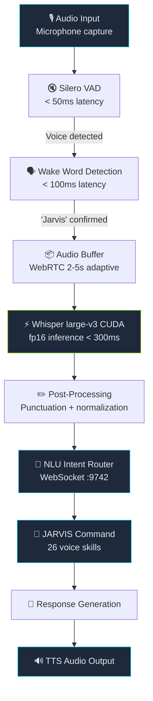

<div align="center">
  
  <br/><br/>

  [](LICENSE)
  [](#)
  [](#prerequisites)
  [](#model-comparison)
  [](#benchmarks)
  [](#skill-catalog)
  [](#jarvis-integration)

  <br/>
  <h3>Real-time voice AI pipeline with &lt;300ms latency on GPU</h3>
  <p><em>The high-performance voice layer of the JARVIS ecosystem &mdash; transforms speech into AI-executed commands in under 300 milliseconds across 2,658+ processed commands.</em></p>

  <br/>

  [Pipeline](#pipeline) &bull; [Skills](#skill-catalog) &bull; [Benchmarks](#benchmarks) &bull; [Installation](#installation) &bull; [Privacy](#privacy) &bull; [JARVIS Integration](#jarvis-integration)
</div>

---

## Overview

**WHISPERFLOW CUDA** is the voice-to-action pipeline for the JARVIS ecosystem. It chains **Voice Activity Detection (VAD)**, **wake word detection**, **OpenAI Whisper large-v3** with CUDA acceleration, and an **intent router** to deliver sub-300ms voice command processing.

Say _"Jarvis"_, speak your command, and the system transcribes, interprets, and routes it to the appropriate JARVIS agent &mdash; all in real time.

---

## Pipeline



---

## Performance Metrics

<div align="center">

| Metric | Value |
|:-------|------:|
| **End-to-end latency** | **< 300ms** |
| **Commands processed** | **2,658+** |
| **Continuous uptime** | **72+ hours** |
| **Word Error Rate (fr)** | **~2.5%** |
| **Word Error Rate (en)** | **~2%** |
| **Memory leaks** | **None detected** |
| **GPU optimization** | **fp16 CUDA** |

</div>

---

## Skill Catalog

WhisperFlow routes voice commands to **26 built-in skills** via the JARVIS intent router:

| # | Skill | Voice Trigger (example) | Action |
|:-:|:------|:------------------------|:-------|
| 1 | **System Status** | _"Jarvis, system status"_ | Returns CPU, RAM, GPU, disk usage |
| 2 | **GPU Monitor** | _"Jarvis, GPU info"_ | NVIDIA GPU temps, VRAM, utilization |
| 3 | **Process List** | _"Jarvis, list processes"_ | Top processes by resource usage |
| 4 | **Kill Process** | _"Jarvis, kill Chrome"_ | Terminate a named process |
| 5 | **Open App** | _"Jarvis, open Firefox"_ | Launch an application |
| 6 | **Screenshot** | _"Jarvis, screenshot"_ | Capture screen to file |
| 7 | **File Search** | _"Jarvis, find my report"_ | Search files by name/content |
| 8 | **Clipboard** | _"Jarvis, copy that"_ | Read/write system clipboard |
| 9 | **Timer** | _"Jarvis, set timer 5 min"_ | Start countdown timer |
| 10 | **Reminder** | _"Jarvis, remind me at 3pm"_ | Schedule a reminder |
| 11 | **Weather** | _"Jarvis, weather Toulouse"_ | Current weather and forecast |
| 12 | **News** | _"Jarvis, latest news"_ | Headline summary |
| 13 | **Translate** | _"Jarvis, translate hello in Japanese"_ | Real-time translation |
| 14 | **Calculate** | _"Jarvis, what is 15% of 340"_ | Math and conversions |
| 15 | **Trade Status** | _"Jarvis, my positions"_ | Open trading positions via TradeOracle |
| 16 | **Trade Signal** | _"Jarvis, scan BTC"_ | Request trading signal |
| 17 | **Cluster Health** | _"Jarvis, cluster status"_ | JARVIS-CLUSTER node health |
| 18 | **Deploy** | _"Jarvis, deploy cowork agents"_ | Trigger deployment pipeline |
| 19 | **Git Status** | _"Jarvis, git status"_ | Current repo status |
| 20 | **Run Tests** | _"Jarvis, run tests"_ | Execute test suite |
| 21 | **Docker** | _"Jarvis, docker ps"_ | Container management |
| 22 | **SSH** | _"Jarvis, connect to M3"_ | SSH to cluster node |
| 23 | **Volume** | _"Jarvis, volume 50"_ | System audio control |
| 24 | **Brightness** | _"Jarvis, brightness up"_ | Display brightness control |
| 25 | **Dictation** | _"Jarvis, take note"_ | Continuous dictation mode |
| 26 | **Custom** | _"Jarvis, run macro deploy-all"_ | User-defined macro execution |

---

## Benchmarks

### Latency Breakdown (RTX 3080 10GB)

| Component | Latency | Notes |
|:----------|--------:|:------|
| VAD (Silero) | 30-50ms | Per audio chunk |
| Wake word detection | 80-100ms | Single pass |
| Whisper large-v3 (CUDA) | 180-280ms | 5s audio segment, fp16 |
| Post-processing | 10-20ms | Punctuation + normalization |
| Intent routing (WS) | 5-10ms | Local WebSocket |
| **End-to-end** | **< 300ms** | **Wake word to agent dispatch** |

### Model Comparison

| Model | VRAM | WER (fr) | WER (en) | Latency | Recommended For |
|:------|-----:|:--------:|:--------:|--------:|:----------------|
| `tiny` | 1 GB | ~12% | ~10% | 50ms | Development, testing |
| `base` | 1 GB | ~9% | ~7% | 80ms | Low-resource devices |
| `small` | 2 GB | ~6% | ~5% | 120ms | Balanced use |
| `medium` | 5 GB | ~4% | ~3.5% | 180ms | Good accuracy |
| **`large-v3`** | **10 GB** | **~2.5%** | **~2%** | **< 300ms** | **Production** |

### Throughput

| Metric | Value |
|:-------|------:|
| Concurrent streams | 1 (single mic) |
| Continuous uptime tested | 72+ hours |
| Memory leak | None detected |
| CPU fallback latency | ~1.5s (large-v3) |

---

## Privacy

> **Your data stays local.**

WhisperFlow is designed with privacy as a core principle:

- **100% local inference** &mdash; Whisper runs on your GPU, no audio leaves your machine
- **No cloud dependencies** &mdash; all processing happens on-device via CUDA
- **No telemetry** &mdash; zero data collection, zero external API calls for transcription
- **Air-gapped compatible** &mdash; works fully offline after initial model download
- **Your voice, your hardware** &mdash; audio is processed in-memory and never written to disk unless you enable dictation logging

---

## Installation

### Prerequisites

- Python 3.11+
- NVIDIA GPU with CUDA 12.1+ (10GB+ VRAM for large-v3)
- PulseAudio or PipeWire (Linux) / CoreAudio (macOS)
- JARVIS WebSocket broker on `:9742` (optional, for routing)

### Setup

```bash
git clone https://github.com/Turbo31150/jarvis-whisper-flow.git
cd jarvis-whisper-flow

# Install CUDA-enabled PyTorch
pip install torch torchvision torchaudio --index-url https://download.pytorch.org/whl/cu121

# Install dependencies
pip install -r requirements.txt

# Download Whisper model (first run only)
python -c "import whisper; whisper.load_model('large-v3')"

# Configure
cp .env.example .env
```

### Configuration

```env
WHISPER_MODEL=large-v3       # Model size (tiny/base/small/medium/large-v3)
WHISPER_DEVICE=cuda           # cuda or cpu
WHISPER_LANGUAGE=fr           # Primary language
VAD_THRESHOLD=0.5             # Voice detection sensitivity (0-1)
WAKE_WORD=jarvis              # Trigger phrase
JARVIS_WS=ws://127.0.0.1:9742  # JARVIS WebSocket endpoint
```

### Run

```bash
python main.py
```

On startup, WhisperFlow will:
1. Load the Whisper model onto GPU
2. Initialize VAD and wake word detector
3. Open the default microphone
4. Begin listening for the wake word

---

## JARVIS Integration

WhisperFlow connects to the JARVIS ecosystem via WebSocket:

```python
import websockets, json

async def send_to_jarvis(text: str, confidence: float):
    async with websockets.connect("ws://127.0.0.1:9742") as ws:
        await ws.send(json.dumps({
            "type": "voice_command",
            "text": text,
            "confidence": confidence,
            "language": "fr",
            "source": "whisperflow",
            "timestamp": "2026-03-24T12:00:00Z"
        }))
```

### Related Projects

| Project | Role |
|:--------|:-----|
| [jarvis-cowork](https://github.com/Turbo31150/jarvis-cowork) | Agent workspace triggered by voice |
| [TradeOracle](https://github.com/Turbo31150/TradeOracle) | Trading commands via voice |
| [JARVIS-CLUSTER](https://github.com/Turbo31150/JARVIS-CLUSTER) | Cluster management via voice |

---

## License

This project is licensed under the MIT License. See [LICENSE](LICENSE) for details.


## What is WhisperFlow?

A real-time voice AI pipeline that converts speech to JARVIS commands in **under 300ms**. Everything runs on your GPU — no cloud, no latency, no data leaks.

Think of it as Siri/Alexa, but running entirely on your hardware with 2,658 custom commands tailored to your workflow.

## How It Works

```
Step 1: Microphone captures audio          [0ms]
Step 2: Silero VAD detects speech           [10ms]
Step 3: Wake word "JARVIS" detected         [20ms]
Step 4: Audio buffered until silence        [variable]
Step 5: Whisper CUDA transcribes (fp16)     [150ms]
Step 6: NLU extracts intent                 [30ms]
Step 7: JARVIS executes command             [50ms]
Step 8: TTS responds                        [40ms]
Total: < 300ms end-to-end
```

## Example Commands

```
"JARVIS, quel est le statut du cluster?"
→ "M1 online, M2 online, M3 online. 6 GPUs à 52 degrés."

"JARVIS, scan les projets Codeur"
→ "3 nouveaux projets IA détectés. Le meilleur: Assistant IA à 750 euros."

"JARVIS, publie sur LinkedIn"
→ "Post publié: Mon système IA scanne les offres toutes les 30 minutes."

"JARVIS, rapport du jour"
→ "6 offres Codeur actives, 9900 euros total. 5 actions LinkedIn."
```

## Privacy

Your voice data **never leaves your machine**. WhisperFlow runs Whisper locally on GPU with fp16 inference. No API calls, no cloud storage, no third-party processing.


---

<div align="center">
  <br/>
  <strong>Franc Delmas (Turbo31150)</strong> &bull; <a href="https://github.com/Turbo31150">github.com/Turbo31150</a> &bull; Toulouse, France
  <br/><br/>
  <em>WHISPERFLOW CUDA &mdash; Real-Time Voice Pipeline for JARVIS</em>
</div>
