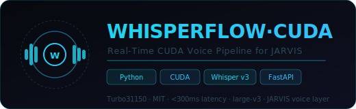

<div align="center">
  
  <br/><br/>

  [](LICENSE)
  [](#)
  [](#)
  [](#modèles)
  [](#performances)
  [](#intégration-jarvis)

  <br/>
  <p><strong>Pipeline voix CUDA temps réel pour JARVIS · Whisper large-v3 · &lt;300ms · STT + VAD + Wake Word</strong></p>
  <p><em>La couche vocale haute performance de l'écosystème JARVIS — transforme la parole en commandes IA en moins de 300ms</em></p>
</div>

---

## Présentation

**WHISPERFLOW·CUDA** est le pipeline voix-vers-texte de JARVIS. Il combine **OpenAI Whisper large-v3** accéléré CUDA, un détecteur d'activité vocale (VAD), et un système de wake word pour créer une interface vocale réactive intégrée à tous les agents JARVIS.

---

## Pipeline

```
Microphone
    │
    ▼
  VAD (Voice Activity Detection)       Silero VAD — filtre silence
    │ voix détectée
    ▼
  Wake Word Detection                  "Jarvis" → active pipeline
    │ wake word confirmé
    ▼
  Audio Buffer (WebRTC)                Tampon 2-5 secondes
    │
    ▼
  Whisper large-v3 CUDA               GPU inference < 300ms
    │ transcription
    ▼
  Post-processing                      Ponctuation · Normalisation
    │
    ▼
  JARVIS Intent Router                 WebSocket :9742 → agents
```

---

## Structure

```
jarvis-whisper-flow/
├── main.py                 ← Démarrage pipeline
├── requirements.txt        ← Dépendances CUDA/Torch
├── pipeline/
│   ├── vad.py              ← Voice Activity Detection
│   ├── wakeword.py         ← Détection "Jarvis"
│   ├── transcriber.py      ← Whisper CUDA core
│   └── router.py           ← Envoi WS :9742
├── models/                 ← Modèles Whisper locaux
├── config/
│   └── settings.py         ← Paramètres GPU, modèle, seuils
└── assets/
    └── logo.svg
```

---

## Modèles

| Modèle | VRAM | WER | Latence | Usage |
|--------|------|-----|---------|-------|
| `tiny` | 1 GB | ~10% | 50ms | Dev / test |
| `base` | 1 GB | ~7% | 80ms | Léger |
| `small` | 2 GB | ~5% | 120ms | Équilibré |
| `medium` | 5 GB | ~3.5% | 180ms | Recommandé |
| **`large-v3`** | **10 GB** | **~2%** | **< 300ms** | **Production** |

---

## Performances

Configuration testée sur **RTX 3080 10GB** :
- Latence STT : **< 300ms** (Whisper large-v3)
- VAD réactivité : **< 50ms**
- Wake word detection : **< 100ms**
- CPU fallback : ~1.5s (large-v3)

---

## Installation

```bash
git clone https://github.com/Turbo31150/jarvis-whisper-flow.git
cd jarvis-whisper-flow

# CUDA + PyTorch
pip install torch torchvision torchaudio --index-url https://download.pytorch.org/whl/cu121
pip install -r requirements.txt

# Télécharger modèle Whisper
python -c "import whisper; whisper.load_model('large-v3')"

# Config
cp .env.example .env
# WHISPER_MODEL=large-v3
# WHISPER_DEVICE=cuda
# JARVIS_WS=ws://127.0.0.1:9742

python main.py
```

---

## Intégration JARVIS

```python
# Le pipeline envoie les transcriptions à JARVIS via WebSocket
import websockets, json

async def send_to_jarvis(text: str):
    async with websockets.connect("ws://127.0.0.1:9742") as ws:
        await ws.send(json.dumps({
            "type": "voice_command",
            "text": text,
            "confidence": 0.98,
            "language": "fr"
        }))
```

---

<div align="center">

**Franc Delmas (Turbo31150)** · [github.com/Turbo31150](https://github.com/Turbo31150) · Toulouse, France

*WHISPERFLOW·CUDA — Real-Time CUDA Voice Pipeline — MIT License*

</div>
