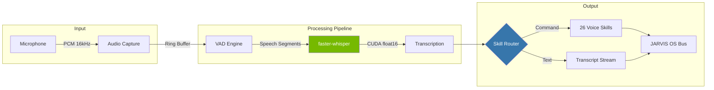

<p align="center">
  
  
  
  
  
</p>

<h1 align="center">jarvis-whisper-flow</h1>

<p align="center">
  <strong>Real-time CUDA speech-to-text pipeline | &lt;300ms latency, 26 voice skills, privacy-first</strong>
</p>

<p align="center">
  Local-first voice recognition engine built for speed and privacy.<br>
  No cloud. No telemetry. No compromise. Your words never leave your machine.
</p>

---

## Key Metrics

| Metric | Value |
|---|---|
| End-to-end latency | **< 300ms** (GPU) |
| Supported languages | **99+** (Whisper multilingual) |
| Available models | `tiny` `base` `small` `medium` `large-v3` |
| Voice skills | **26** built-in commands |
| Audio backends | PulseAudio, ALSA, PipeWire |
| GPU acceleration | CUDA (float16 / int8) |
| Privacy | **100% local** - zero network calls |

---

## Architecture



```
 Mic --> [Audio Capture] --> [VAD] --> [faster-whisper + CUDA]
                                              |
                                     +--------+--------+
                                     |                 |
                              [Skill Router]    [Raw Transcript]
                                     |                 |
                              [26 Voice Skills]  [Stream Output]
                                     |                 |
                                     +--------+--------+
                                              |
                                       [JARVIS OS Bus]
```

---

## Quick Start

```bash
# 1. Clone
git clone https://github.com/Turbo31150/jarvis-whisper-flow.git
cd jarvis-whisper-flow

# 2. Install dependencies
pip install -r requirements.txt

# 3. Run (auto-detects GPU)
python whisper_flow.py --model large-v3 --lang fr

# Or use Docker
docker compose up -d
```

> **Prerequisites:** Python 3.10+, CUDA 11.8+, ~4GB VRAM for `large-v3`

---

## Tech Stack

| Component | Technology |
|---|---|
| STT Engine | [faster-whisper](https://github.com/SYSTRAN/faster-whisper) (CTranslate2) |
| Voice Activity | Silero VAD |
| GPU Runtime | CUDA / cuDNN (float16, int8 quantization) |
| Audio I/O | PyAudio / sounddevice |
| Skill Framework | Custom Python skill router |
| Container | Docker + NVIDIA Container Toolkit |
| Language | Python (528 KB), Shell, Dockerfile |

---

## Voice Skills (26)

Built-in skill categories include:

- **System control** - volume, brightness, lock, shutdown
- **Application launch** - open browser, terminal, editor
- **Navigation** - switch workspace, minimize, maximize
- **Dictation** - continuous transcription to clipboard or file
- **JARVIS integration** - trigger automations, query status, execute missions

Skills are hot-reloadable. Drop a Python file in `skills/` and it registers automatically.

---

## Configuration

```yaml
# config.yaml
model: large-v3
language: fr
device: cuda
compute_type: float16
vad_threshold: 0.5
beam_size: 5
silence_duration: 0.8
```

---

## Benchmarks

| Model | VRAM | Latency (avg) | WER (fr) |
|---|---|---|---|
| `tiny` | 1 GB | ~80ms | 12.4% |
| `base` | 1 GB | ~120ms | 8.7% |
| `small` | 2 GB | ~180ms | 6.1% |
| `medium` | 5 GB | ~250ms | 4.8% |
| `large-v3` | 4 GB | ~290ms | 3.2% |

> Measured on RTX 3060 12GB, Ubuntu 24.04, CUDA 12.4

---

## Related Projects

| Project | Description |
|---|---|
| [jarvis-linux](https://github.com/Turbo31150/jarvis-linux) | JARVIS OS - Distributed AI operating system |
| [jarvis-core](https://github.com/Turbo31150/jarvis-core) | Core engine, memory, and agent framework |
| [jarvis-trading](https://github.com/Turbo31150/jarvis-trading) | AI-powered crypto trading pipeline |

---

## Contributing

Contributions are welcome. Please open an issue first to discuss what you would like to change.

```bash
# Run tests
pytest tests/ -v

# Lint
ruff check .
```

---

## License

[MIT](LICENSE) - Use it, fork it, ship it.

---

<p align="center">
  Part of the <a href="https://github.com/Turbo31150/jarvis-linux"><strong>JARVIS OS</strong></a> ecosystem<br>
  <sub>Built with faster-whisper, CUDA, and zero cloud dependencies.</sub>
</p>
